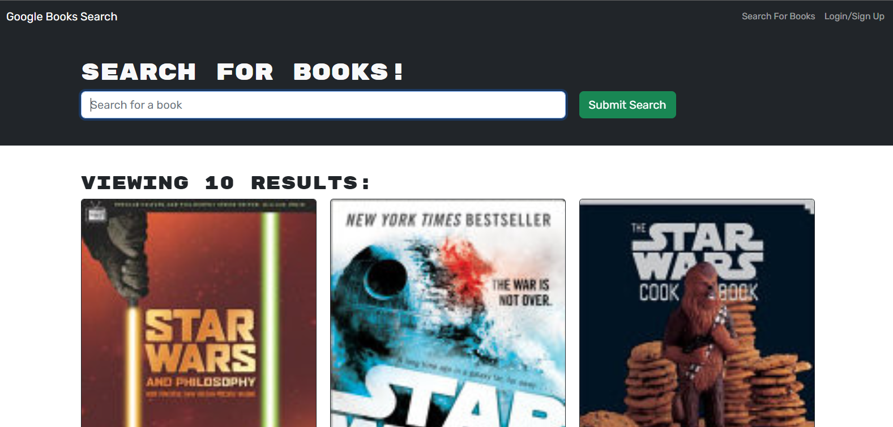
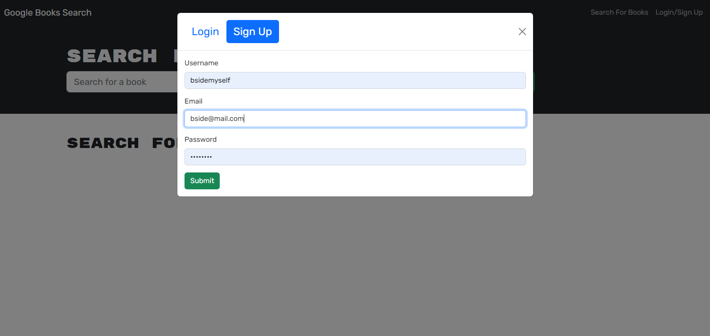
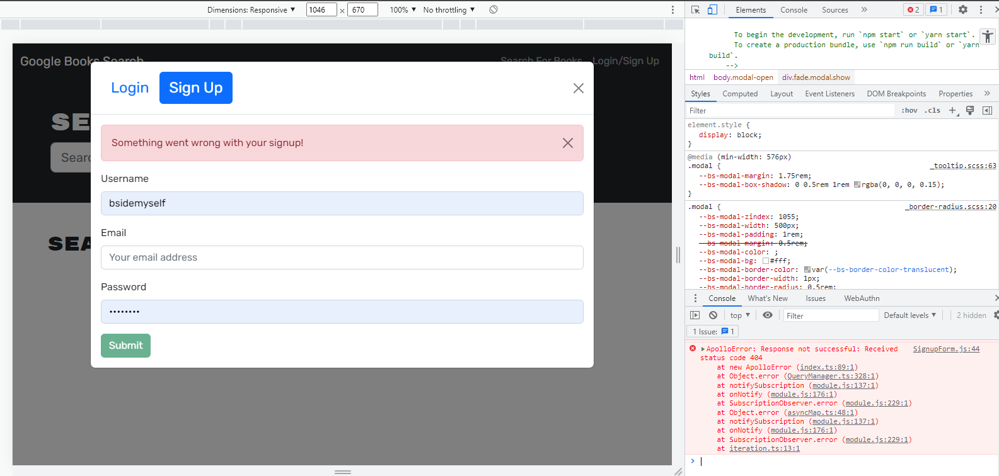

# Book Search/Save App - MERN
## Description
The purpose of this app was to take a RESTful API working book search app and make it a REACT/MERN app instead using states and mutations.
## How to Use
To use the app in this state, download the repo and run "npm run develop"
## State of this App (get it?)
I was able to get connected to the book API and search but there is an issue with getting into the Apollo server.  I am getting a 404 when the Apollo server starts and I am unable to login or create a new user.  It says in the error that the problem is in the SignupForm.js but I could not figure out how to fix the issue, so I wasn't able to deploy to Heroku. Screenshots are below of the partial functionality. I hope to work through this issue with a tutor and resubmit a fully working version.
## Screenshots

## Link to GitHub Repo
https://github.com/bsidemyself/sshack-wk21-mern